---
output:
  xaringan::moon_reader:
    css: ["xaringan-themer.css", "style.css"]
    lib_dir: libs
    nature:
      slideNumberFormat: |
        <div class="progress-bar-container">
          <div class="progress-bar" style="width: calc(%current% / %total% * 100%);">
          </div>
        </div>
      highlightStyle: github
      highlightLines: true
      ratio: "16:9"
      beforeInit: "macros.js"
    includes:
      in_header: header.html
    seal: false
always_allow_html: true
tables: true
---

```{r setup, include=FALSE}
options(htmltools.dir.version = FALSE)
knitr::opts_chunk$set(fig.showtext = TRUE)
#knitr::opts_chunk$set(cache=TRUE)
```

```{r xaringan-themer, include=FALSE, warning=FALSE}
library(PrettyCols)
cols = prettycols("Relax")
col1 = cols[1]
col2 = cols[2]
col3 = cols[3]
col4 = cols[4]
col5 = cols[5]

library(xaringanthemer)

theme_xaringan(
  text_color = "#333f48",
  background_color = "#FFFFFF",
  accent_color = "#820a94",
  text_font = "Fira Mono",
  text_font_use_google = TRUE,
  title_font = "Fira Sans Condensed",
  title_font_use_google = TRUE
)

style_mono_accent(
  #base_color = "#bf5700",
  extra_fonts = list(google_font("Fira Sans","200","300","400","500","600"),
                     google_font("Fira Sans Condensed"),
                     google_font("Jost")),
  base_color = "#333f48",
  header_font_google = google_font("Yanone Kaffeesatz","200","300","400","500","600","700"),
  text_font_google   = google_font("Jost"),
  code_font_google   = google_font("Fira Mono"),
  text_bold_color = "#333f48",
  text_font_size = "130%",
  colors = c(
    red = "#f34213",
    purple = "#820a94",
    orange = "#ff8811",
    green = "#136f63",
    white = "#FFFFFF",
    darkorange = "#0F8D94",
    coolblue = "#4493AE",
    darkgrey = "#A9A9A9"),
  extra_css = list(
    ".body" = list("font-family" = "Jost"),
    ".remark-slide table" = list("display" = "table",
                   "width" = "80%",
                   "text-align" = "left"),
    
    #".remark-slide-number" = list("display" = "none"),
    
    ".strong" = list("font-weight" = "400"),
    ".big" = list("font-size" = "250%",
                     "font-family" = "Yanone Kaffeesatz",
                     "font-weight"="400"),
    ".small" = list("font-size" = "80%"),
    ".smaller" = list("font-size" = "70%"),
    ".tiny" = list("font-size" = "50%"),
    ".tinylist" = list("font-size" = "62.5%"),
    ".source" = list("color" = "#8c8c8c",
                     "font-size" = "80%"),
    ".remark-slide table td#highlight" = list("background-color" = "#eee1f0",
                                  "color" = "#820a94",
                                  "font-weight" = "500"),
   # ".remark-slide table thead th" = list(),
    ".title-slide h1" = list("font-weight" = "500"),
    ".title-slide h2" = list("font-weight" = "400",
                             "font-size" =  "100%",
                             "font-family" = "Jost"),
    ".title-slide h3" = list("font-family" = "Jost",
                             "font-size" = "80%",
                             "font-weight" = "200"),
    ".center2" = list("margin" = "0",
                      "position" = "absolute",
                      "top" = "50%",
                      "left" = "50%",
                      "-ms-transform" = "translate(-50%, -50%)",
                      "transform" = "translate(-50%, -50%)"),
    ".section-title h1" = list("color" = "#FFFFFF",
                               "font-size" = "2.3em",
                               "line-height" = "1.3"),
    ".medium" = list("font-size" = "1.4em"),
    ".sp-after-half" = list("margin-bottom" = "0.7em !important"),
    ".box-1,.box-1a,.box-1s,.box-1b,.box-1l,.box-1LA,.section-title-1" = list("background-color" = "#3b0768",
                                                                              "border-radius" = "15px"),
    ".box-2,.box-2a,.box-2s,.box-2b,.box-2l,.box-2LA,.section-title-2" = list("background-color" = "#291594",
                                                                              "border-radius" = "15px"),
    ".box-3,.box-3a,.box-3s,.box-3b,.box-3l,.box-3LA,.section-title-3" = list("background-color" = "#820a94",
                                                                              "border-radius" = "15px"),
    ".box-4,.box-4a,.box-4s,.box-4b,.box-4l,.box-4LA,.section-title-4" = list("background-color" = "#BF3984",
                                                                              "border-radius" = "15px"),
    ".box-5,.box-5a,.box-5s,.box-5b,.box-5l,.box-5LA,.section-title-5" = list("background-color" = "#f87241",
                                                                              "border-radius" = "15px"),
    ".box-6,.box-6a,.box-6s,.box-6b,.box-6l,.box-6LA,.section-title-6" = list("background-color" = "#F89441",
                                                                              "border-radius" = "15px"),
    ".box-7,.box-7a,.box-7s,.box-7b,.box-7l,.box-7LA,.section-title-7" = list("background-color" = "#f8c741",
                                                                              "border-radius" = "15px"),
   
    ".box-7, .box-6, .box-5, .box-4, .box-3, .box-2, .box-1" = list("color" = "#FFFFFF",
                                                                    "margin" = "0em auto",
                                                                    "overflow" = "hidden",
                                                                    "padding" = "0.4em 0.4em",
                                                                    "font-weight" = "600",
                                                                    "font-size" = "31px",
                                                                    "display" = "table",
                                                                    "text-align" = "center",
                                                                    "font-family" = "Jost"),
    ".box-7a, .box-6a, .box-5a, .box-4a, .box-3a, .box-2a, .box-1a" = list("color" = "#FFFFFF",
                                                                          "left" = "0px",
                                                                          "overflow" = "hidden",
                                                                      "padding" = "0.4em 0.4em",
                                                                      "font-weight" = "600",
                                                                      "font-size" = "25px",
                                                                      "display" = "table",
                                                                      "text-align" = "center",
                                                                      "font-family" = "Fira Sans"),
       ".box-7b, .box-6b, .box-5b, .box-4b, .box-3b, .box-2b, .box-1b" = list("color" = "#FFFFFF",
                                                                          "left" = "0px",
                                                                          "overflow" = "hidden",
                                                                      "padding" = "0.4em 0.4em",
                                                                      "font-weight" = "600",
                                                                      "font-size" = "25px",
                                                                      "display" = "table",
                                                                      "text-align" = "left",
                                                                      "font-family" = "Fira Sans"),
       ".medium" = list("font-size" = "1.4em"),
    ".sp-after-half" = list("margin-bottom" = "0.7em !important"),
    ".box-0" = list("background-color" = "#DAE058",
                    "border-radius" = "15px",
                    "font-size" = "110%",
                    "color" = "#FFFFFF",
                    "margin" = "0em auto",
                    "overflow" = "hidden",
                    "padding" = "0.4em 0.4em",
                    "display" = "table"),
    # ".box-1,.box-1a,.box-1s,.box-1b,.box-1l,.box-1LA,.section-title-1" = list("background-color" = "#6e077d",
    #                                                                           "border-radius" = "15px"),
    # ".box-2,.box-2a,.box-2s,.box-2b,.box-2l,.box-2LA,.section-title-2" = list("background-color" = "#800791",
    #                                                                           "border-radius" = "15px"),
    # ".box-3,.box-3a,.box-3s,.box-3b,.box-3l,.box-3LA,.section-title-3" = list("background-color" = "#820a94",
    #                                                                           "border-radius" = "15px"),
    # ".box-4,.box-4a,.box-4s,.box-4b,.box-4l,.box-4LA,.section-title-4" = list("background-color" = "#A5AC20",
    #                                                                           "border-radius" = "15px"),
    # ".box-5,.box-5a,.box-5s,.box-5b,.box-5l,.box-5LA,.section-title-5" = list("background-color" = "#f28122",
    #                                                                           "border-radius" = "15px"),
    # ".box-6,.box-6a,.box-6s,.box-6b,.box-6l,.box-6LA,.section-title-6" = list("background-color" = "#F89441",
    #                                                                           "border-radius" = "15px"),
    # ".box-7,.box-7a,.box-7s,.box-7b,.box-7l,.box-7LA,.section-title-7" = list("background-color" = "#faa055",
    #                                                                           "border-radius" = "15px"),
   
   ".box-1t,.box-1tL,.section-title-1t" = list("background-color" = "rgba(13, 8, 135,0.3)",
                                      "color"="rgba(13, 8, 135,1)",
                                      "font-family" = "Yanone Kaffeesatz",
                                      "border-radius" = "15px"),
    ".box-2t,.box-2tL,.section-title-2t" = list("background-color" = "rgba(86, 1, 164,0.3)",
                                       "color" = "rgba(86, 1, 164,1)",
                                       "font-family" = "Yanone Kaffeesatz",
                                       "border-radius" = "15px"),
    ".box-3t,.box-3tL,.section-title-3t" = list("background-color" = "rgba(144, 13, 164,0.3)",
                                       "color" = "rgba(144, 13, 164,1)",
                                       "font-family" = "Yanone Kaffeesatz",
                                       "border-radius" = "15px"),
    ".box-4t,.box-4tL,.section-title-4t" = list("background-color" = "rgba(191, 57, 132,0.3)",
                                       "color" = "rgba(191, 57, 132,1)",
                                       "font-family" = "Yanone Kaffeesatz",
                                       "border-radius" = "15px"),
    ".box-5t,.box-5tL,.section-title-5t" = list("background-color" = "rgba(225, 100, 98,0.3)",
                                       "color" = "rgba(225, 100, 98,1)",
                                       "font-family" = "Jost",
                                       "border-radius" = "15px"),
    ".box-6t,.box-6tL,.section-title-6t" = list("background-color" = "rgba(248, 148, 65,0.3)",
                                       "color" = "rgba(248, 148, 65,1)",
                                       "font-family" = "Yanone Kaffeesatz",
                                       "border-radius" = "15px"),
    ".box-7t,.box-7tL,.section-title-7t" = list("background-color" = "rgba(252, 206, 37,0.3)",
                                       "color" = "rgba(252, 206, 37,1)",
                                       "font-family" = "Yanone Kaffeesatz",
                                       "border-radius" = "15px"),
   
   ".box-7t, .box-6t, .box-5t, .box-4t, .box-3t, .box-2t, .box-1t" = list("margin" = "0em auto",
                                                                    "overflow" = "hidden",
                                                                    "padding" = "0.4em 0.4em",
                                                                    "font-weight" = "600",
                                                                    "font-size" = "25px",
                                                                    "display" = "table",
                                                                    "text-align" = "center"),
   
   ".box-7tL, .box-6tL, .box-5tL, .box-4tL, .box-3tL, .box-2tL, .box-1tL" = list("margin" = "0em auto",
                                                                    "overflow" = "hidden",
                                                                    "padding" = "0.4em 0.4em",
                                                                    "font-weight" = "600",
                                                                    "font-size" = "50px",
                                                                    "display" = "table",
                                                                    "text-align" = "center"),
   
    ".box-7, .box-6, .box-5, .box-4, .box-3, .box-2, .box-1" = list("color" = "#FFFFFF",
                                                                    "margin" = "0em auto",
                                                                    "overflow" = "hidden",
                                                                    "padding" = "0.4em 0.4em",
                                                                    "font-weight" = "600",
                                                                    "font-size" = "31px",
                                                                    "display" = "table",
                                                                    "text-align" = "center",
                                                                    "font-family" = "Jost"),
    ".box-7a, .box-6a, .box-5a, .box-4a, .box-3a, .box-2a, .box-1a" = list("color" = "#FFFFFF",
                                                                          "left" = "0px",
                                                                          "overflow" = "hidden",
                                                                      "padding" = "0.4em 0.4em",
                                                                      "font-weight" = "600",
                                                                      "font-size" = "25px",
                                                                      "display" = "table",
                                                                      "text-align" = "center",
                                                                      "font-family" = "Yanone Kaffeesatz"),
   ".box-7s, .box-6s, .box-5s, .box-4s, .box-3s, .box-2s, .box-1s" = list("color" = "#FFFFFF",
                                                                          "left" = "0px",
                                                                          "overflow" = "hidden",
                                                                      "padding" = "0.2em 0.2em",
                                                                      "font-weight" = "400",
                                                                      "font-size" = "100%",
                                                                      "display" = "inline",
                                                                      "text-align" = "center",
                                                                      "font-family" = "Yanone Kaffeesatz"),
       ".box-7b, .box-6b, .box-5b, .box-4b, .box-3b, .box-2b, .box-1b" = list("color" = "#FFFFFF",
                                                                          "left" = "0px",
                                                                          "overflow" = "hidden",
                                                                      "padding" = "0.4em 0.4em",
                                                                      "font-weight" = "600",
                                                                      "font-size" = "25px",
                                                                      "display" = "table",
                                                                      "text-align" = "left",
                                                                      "font-family" = "Yanone Kaffeesatz"),
   ".box-7l, .box-6l, .box-5l, .box-4l, .box-3l, .box-2l, .box-1l" = list("color" = "#FFFFFF",
                                                                    "margin" = "0em auto",
                                                                    "overflow" = "hidden",
                                                                    "padding" = "0.4em 0.4em",
                                                                    "font-weight" = "600",
                                                                    "font-size" = "45px",
                                                                    "display" = "table",
                                                                    "text-align" = "center",
                                                                      "font-family" = "Yanone Kaffeesatz"),
   ".box-7LA, .box-6LA, .box-5LA, .box-4LA, .box-3LA, .box-2LA, .box-1LA" = list("color" = "#FFFFFF",
                                                                    "margin" = "0em auto",
                                                                    "overflow" = "hidden",
                                                                    "padding" = "0.4em 0.4em",
                                                                    "font-weight" = "600",
                                                                    "font-size" = "55px",
                                                                    "display" = "table",
                                                                    "text-align" = "center",
                                                                      "font-family" = "Yanone Kaffeesatz"),
       ".box-1trans,.box-2trans,.box-3trans,.box-4trans,.box-5trans,.box-6trans,.box-7trans" = list("background-color" = "#FFFFFF",
                                                                                                 "font-family" = "Jost",
                                                                                                 "border-radius" = "15px",
                                                                                                 "margin" = "0em auto",
                                                                                                 "overflow" = "hidden",
                                                                                                 "padding" = "0.4em 0.4em",
                                                                                                 "font-weight" = "400",
                                                                                                 "font-size" = "25px",
                                                                                                 "display" = "table",
                                                                                                 "text-align" = "center",
                                                                                                 "border-width" = "thick",
                                                                                                 "color" = "#333f48"),
   
       ".box-1Trans,.box-2Trans,.box-3Trans,.box-4Trans,.box-5Trans,.box-6Trans,.box-7Trans" = list("background-color" = "#FFFFFF",
                                                                                                 "font-family" = "Yanone Kaffeesatz",
                                                                                                 "border-radius" = "15px",
                                                                                                 "margin" = "0em auto",
                                                                                                 "overflow" = "hidden",
                                                                                                 "padding" = "0.4em 0.4em",
                                                                                                 "font-weight" = "600",
                                                                                                 "font-size" = "51px",
                                                                                                 "display" = "table",
                                                                                                 "text-align" = "center",
                                                                                                 "border-width" = "thick",
                                                                                                 "color" = "#333f48"),
   
       ".box-1transl,.box-2transl,.box-3transl,.box-4transl,.box-5transl,.box-6transl,.box-7transl" = list("background-color" = "#FFFFFF",
                                                                                                           "font-family" = "Yanone Kaffeesatz",
                                                                                                           "border-radius" = "15px",
                                                                                                           "left" = "0px",
                                                                                                           "overflow" = "hidden",
                                                                                                           "padding" = "0.4em 0.4em",
                                                                                                           "font-weight" = "400",
                                                                                                           "font-size" = "31px",
                                                                                                           "display" = "table",
                                                                                                           "text-align" = "left",
                                                                                                           "border-width" = "thick",
                                                                                                           "color" = "#333f48"),
   
   
    ".box-1trans,.box-1transl,.box-1Trans" = list("border"="5px solid #4B3F72"),
    ".box-2trans,.box-2transl,.box-2Trans" = list("border"="5px solid #CBB3BF"),
    ".box-3trans,.box-3transl,.box-3Trans" = list("border"="5px solid #FFC857"),
    ".box-4trans,.box-4transl,.box-4Trans" = list("border"="5px solid #119DA4"),
    ".box-5trans,.box-5transl,.box-5Trans" = list("border"="5px solid #19647E"),
    ".box-6trans,.box-6transl,.box-6Trans" = list("border"="5px solid #0F8D94"),
    ".box-7trans,.box-7transl,.box-7Trans" = list("border"="5px solid #f8c741"),
   
   ".image-80 img" = list("scale" = "80%"),
   ".pull-left-little_l" = list("float" = "left",
                                "width" = "57%"),
   ".pull-right-little_l" = list("float" = "right",
                                "width" = "37%"),
   ".pull-left-little_r" = list("float" = "left",
                                "width" = "27%"),
   ".pull-right-little_r" = list("float" = "right",
                                "width" = "67%")

  )
)

#,"li" = list("font-size" = "150%")
#    "li" = list("font-size" = "110%"),
#    "ul" = list("font-size" = "110%"),
#color palette
#5601A4
#820a94
#F89441
#FCCE25
```

```{r setup2, echo=FALSE, message=FALSE, warning = FALSE}
library(knitr)
library(showtext)
library(xaringanExtra)

options(knitr.table.format = "html") 

#xaringanExtra::use_scribble()

```

```{r fonts, message=FALSE, echo=FALSE, warning = FALSE}
font_add_google("Fira Sans Condensed", "Fira Sans Condensed")
font_add_google("Fira Sans", "Fira Sans")
font_add_google("Jost", "Jost")
```

```{r, echo=FALSE, message=FALSE, warning=FALSE}
library(tidyverse)
library(ggthemes)
library(ggplot2)
library(firasans)
library(hrbrthemes)
library(extrafont)
library(RColorBrewer)
library(firasans)
library(hrbrthemes)
library(extrafont)
library(gridExtra)
library(pBrackets)
library(patchwork)

#loadfonts(device = "win")

options(scipen = 0)
```

class: inverse, center, middle

<br>
<br>
<br>

<h1 class="title-own">Difference-in-Differences<br/>using Mixed-Integer Programming Matching Approach</h1>

<br>
<br>
.small[Magdalena Bennett&nbsp;&nbsp;&nbsp;<br>*McCombs School of Business, The University of Texas at Austin*&nbsp;&nbsp;&nbsp;]

<br>

.small[AEFP 50th Conference, Washington DC<br>March 13th, 2025]


---
# Diff-in-Diff as an identification strategy

.center[
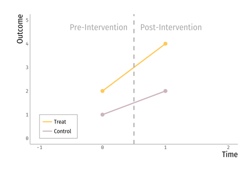
]

---
# Parallel trend assumption (PTA)

.center[
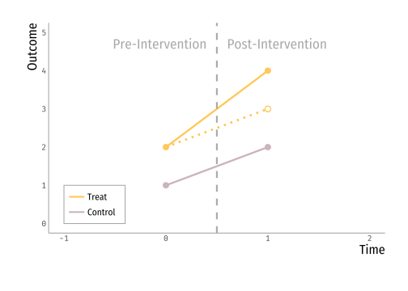
]

---
# Estimate Average Treatment Effect on the Treated (ATT)

.center[
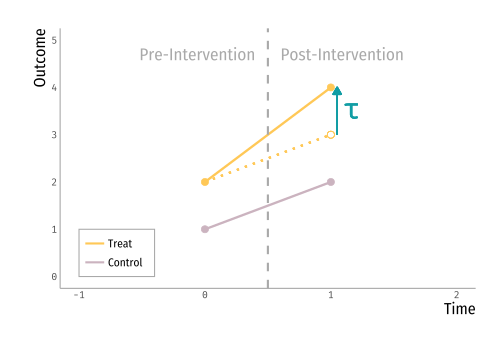
]

---
# But what if the PTA doesn't hold?

<br>
<br>
.pull-left[
.center[
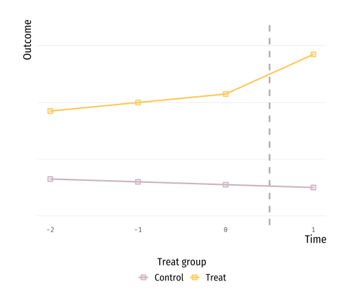
]
]

---
# But what if the PTA doesn't hold?

.box-6trans[We can potentially remove [part of] the bias by matching on <i>X<sup>s</sup><sub>it</sub>=X<sub>i</sub></i>]

.pull-left[
.center[

]
]

.pull-right[
.center[
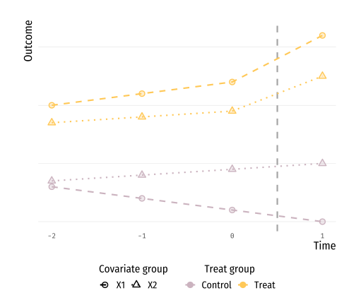
]
]

---

# This paper

- Identify contexts when matching can recover causal estimates under **.darkorange[certain violations of the parallel trend assumption]**.

  - Overall <u>bias reduction</u> and increase in <u>robustness for sensitivity analysis</u>.


- Use **.darkorange[mixed-integer programming matching (MIP)]** to balance covariates directly.

--
<br/>
<br/>

.pull-left[
.box-6trans[**Simulations:**<br/>Different DGP scenarios]
]

.pull-right[
.box-6trans[**Application:**<br/>School segregation & vouchers]
]

---

background-position: 50% 50%
class: left, bottom, inverse
.big[
Let's set up the problem
<br>
<br>
]

---

# DD Setup

- Let $Y_{it}(z)$ be the potential outcome for unit $i$ in period $t$ under treatment $z$.

- Intervention implemented in $T_0$ $\rightarrow$ No units are treated in $t\leq T_0$
--

- Difference-in-Differences (DD) focuses on ATT for $t>T_0$:

$$ATT(t) = E[Y_{it}(1) - Y_{it}(0)|Z=1]$$


---

# DD Setup

- Let $Y_{it}(z)$ be the potential outcome for unit $i$ in period $t$ under treatment $z$.

- Intervention implemented in $T_0$ $\rightarrow$ No units are treated in $t\leq T_0$

- Difference-in-Differences (DD) focuses on ATT for $t>T_0$:

$$ATT(t) = E[Y_{it}(1) - Y_{it}(0)|Z=1]$$

- Under the PTA:

$$\begin{align}
\hat{\tau}^{DD} = &\color{#FFC857}{\overbrace{\color{black}{E[Y_{i1}|Z=1] - E[Y_{i1}|Z=0]}}^{\color{#FFC857}{\Delta_{post}}}} - \\
&\color{#CBB3BF}{\underbrace{\color{black}{(E[Y_{i0}|Z=1] - E[Y_{i0}|Z=0])}}_{\color{#CBB3BF}{\Delta_{pre}}}}
\end{align}$$

---
# Bias in a DD setting

Bias can be introduced to DD in different ways:

--

1) **.darkorange[Time-invariant covariates with time-varying effects]**: *Obs. Bias*
  - e.g. Effect of gender on salaries.
  
--

2) **.darkorange[Differential time-varying effects]**: *Obs. Diff. Bias*

  - e.g. Effect of race on salaries evolve differently over time by group.

--

3) **.darkorange[Observed or unobserved time-varying covariates]**: *Unobs. Bias*

  - e.g. Test scores


---
# If the PTA holds...

$$\begin{array}{rcc}
\overbrace{(\bar{\gamma}_1(X^1,t') - \bar{\gamma}_1(X^0,t')) - (\bar{\gamma}_1(X^1,t) - \bar{\gamma}_1(X^0,t))}^{Obs. Bias} +& \\ \underbrace{(\bar{\gamma}_2(X^1,t') -  
\bar{\gamma}_2(X^1,t))}_{Obs. Diff. Bias} + \underbrace{(\lambda_{t'1}-\lambda_{t'0}) - (\lambda_{t1} - \lambda_{t0})}_{Unobs. Bias}&= 0 \\
\end{array}$$

--
.small[
**.darkorange[One of the two]** conditions need to hold:

1) No effect or constant effect of $X$ on $Y$ over time: $\mathbb{E}[\gamma_1(X,t)] = \mathbb{E}[\gamma_1(X)]$

2) Equal distribution of observed covariates between groups: $X_i|Z=1 \overset{d}{=} X_i|Z=0$
]
--

.small[
**.darkorange[in addition to]**:

3) No differential time effect of $X$ on $Y$ by treatment group: $\mathbb{E}[\gamma_2(X,t)] = 0$

4) No unobserved time-varying effects: $\lambda_{t1} = \lambda_{t0}$
]
--

<br>
.small[
.pull-left[
.box-6trans[**Cond. 2** can hold through **matching**]
]]
--
.small[
.pull-right[
.box-6trans[**Cond. 3 and 4** can be tested with **sensitivity analysis**]
]
]
---
# Sensitivity analysis for Diff-in-Diff

- In an event study $\rightarrow$ null effects prior to the intervention:

.center[
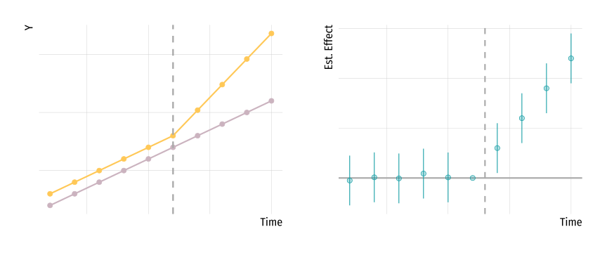
]

---
# Honest approach to test pretrends

- One main issue with the previous test $\rightarrow$ **.darkorange[Underpowered]**

--

- Rambachan & Roth (2023) propose **.darkorange[sensitivity bounds]** to allow pre-trends violations:

  - E.g. Violations in the post-intervention period can be _at most_ $M$ times the max violation in the pre-intervention period.

--

.center[
]

---
background-position: 50% 50%
class: left, bottom, inverse
.big[
Simulations
<br>
<br>
]

---
# Different scenarios


For linear and quadratic functions:
<br>

.box-1trans[S1: No interaction between X and t]

.box-2trans[S2: Equal interaction between X and t]

.box-3trans[S3: Differential interaction between X and t]

.box-4trans[S4: S3 + Bias cancellation]

--
<br>

- For all scenarios, differential distribution of covariates $X$ between groups


---
#Parameters:

.center[
Parameter                            | Value
-------------------------------------|----------------------------------------------
Number of obs (N)                               | 1,000 
`Pr(Z=1)`              | 0.5 
Time periods (T)          | 8 
Last pre-intervention period (T_0)          | 4 
Matching PS          | Nearest neighbor (using calipers)
MIP Matching tolerance          | .01 SD
Number of simulations | 1,000
]

- Estimate compared to sample ATT (_can be different for matching_)

---
# S1 - No interaction between X and t

.center[
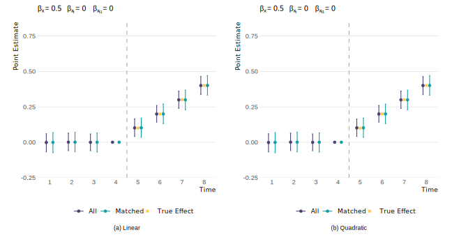]

---
# S2 - Equal interaction between X and t by treatment

.center[
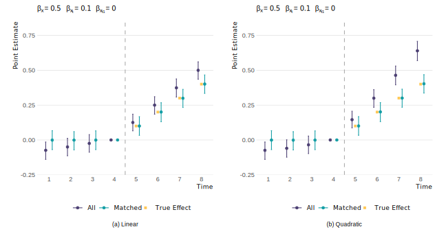]

---
# S3 - Differential interaction between X and t by treatment

.center[
]

---
# Why is this bias reduction important?

- Example of S2 (Quadratic) with no true effect:

.center[

]

---
# Why is this bias reduction important?

- Even under modest bias, we would incorrectly reject the null 20% of the time.

.center[
]

---
# Why is this bias reduction important?

- Sensitivity analysis results are skewed by the magnitude of the bias.

.center[
]

---
# S4: Bias cancellation

.center[
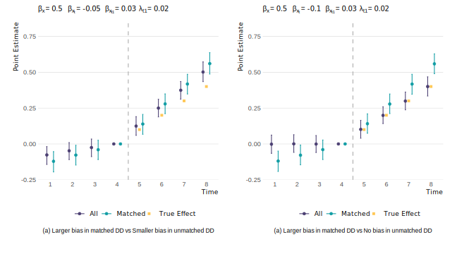
]

---
background-position: 50% 50%
class: left, bottom, inverse
.big[
Application
<br>
<br>
]
---
#Preferential Voucher Scheme in Chile

- Universal **.darkorange[flat voucher]** scheme $\stackrel{\mathbf{2008}}{\mathbf{\longrightarrow}}$ Universal + **.darkorange[preferential voucher]** scheme

- Preferential voucher scheme:
  - Targeted to bottom 40% of vulnerable students

  - Additional 50% of voucher per student

  - Additional money for concentration of SEP students.

--

<br/>
.pull-left[
.center[
.box-6trans[**Students:**<br/>- Verify SEP status<br/>- Attend a SEP school]
]
]

.pull-right[
.center[
.box-6trans[**Schools:**<br/>- Opt-into the policy<br/>- No selection, no fees<br/>- Resources ~ performance]
]
]

---
#Before matching: Household income

.pull-left[
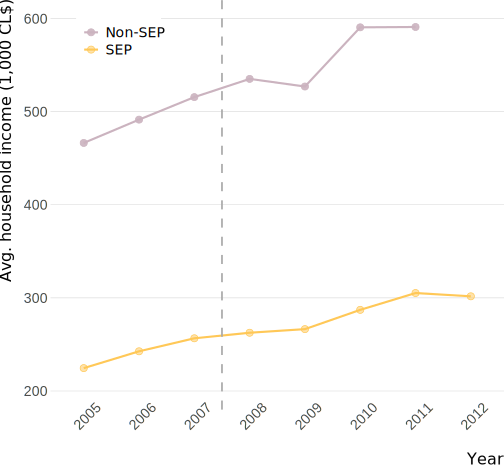
]  

.pull-right[

]

---
#Before matching: Average SIMCE

.pull-left[
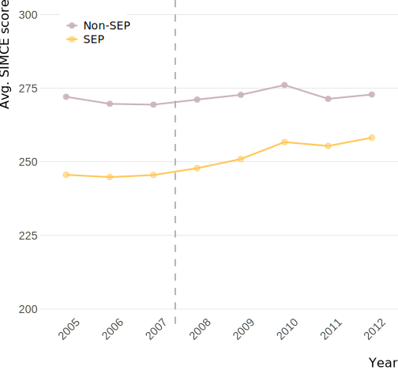
]  

.pull-right[
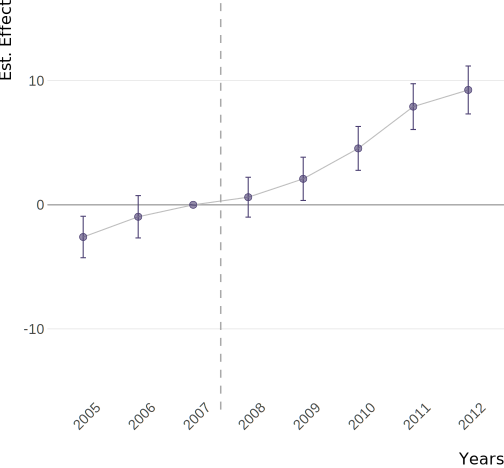
]

---
# Matching + DD

- **.darkorange[Prior to matching]**: No parallel pre-trend

- **.darkorange[Different types of schools]**:

  - Schools that charge high co-payment fees.
  
  - Schools with low number of SEP student enrolled.

- **.darkorange[MIP Matching]** using constant or "sticky" covariates:

  - Mean balance (0.025 SD): Enrollment, average yearly subsidy, number of voucher schools in county, charges add-on fees
  
  - Exact balance: Geographic province
  
---
# Groups are balanced in specific characteristics

.center[
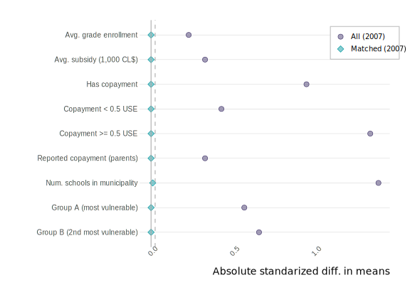]

---
# Matching in 16 out of 53 provinces 

.center[
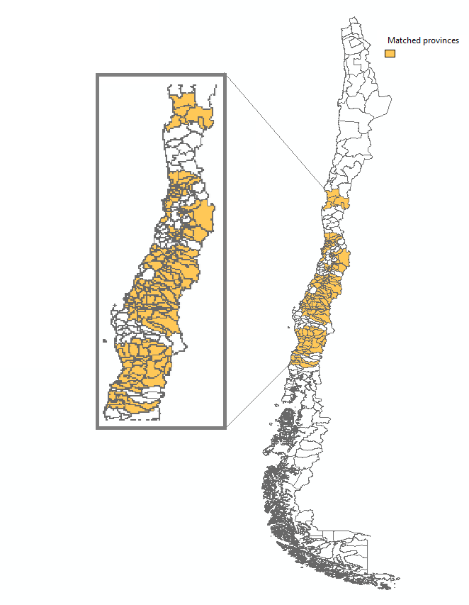]

---
# After matching: Household income

.pull-left[
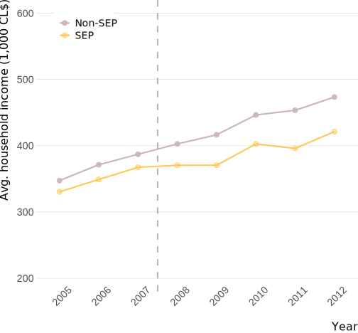
]  

.pull-right[

]

---
#After matching: Average SIMCE

.pull-left[
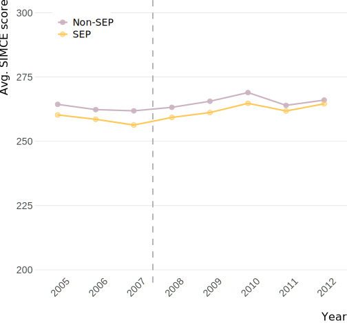
]  

.pull-right[

]

---
#Results

- **.darkorange[Matched schools]**:

  - More vulnerable and lower test scores than the population mean.
--

- **.darkorange[9pp increase in the income gap]** between SEP and non-SEP schools in matched DD:

  - SEP schools attracted even more vulnerable students.
  
  - Non-SEP schools increased their average family income.
--

- **.darkorange[No evidence of increase in SIMCE score]**:
  
  - Could be a longer-term outcome. 
--

- Findings in segregation are **.darkorange[moderately robust to hidden bias]** (Keele et al., 2019):
  
  - $\Gamma_c = 1.76$ $\rightarrow$ Unobserved confounder would have to change the probability of assignment from 50% vs 50% to 32.7% vs 67.3%.
  
  - Allows up to 70% of the maximum deviation in the pre-intervention period (*M = 0.7*) vs 50% without matching (Rambachan & Roth, 2023)
  
---
# Potential reasons?

- Increase in probability of becoming SEP in 2009 **.darkorange[jumps discontinuously at 60%]** of SEP student concentration in 2008 (4.7 pp; SE = 0.024)

.center[
]

---
background-position: 50% 50%
class: left, bottom, inverse
.big[
Let's wrap it up
<br>
<br>
]
---
# Conclusions and Next Steps

.pull-left[
- Matching can be an important tool to address **.darkorange[violations in PTA]**.


- **.darkorange[Bias reduction]** is very important for sensitivity analysis.


- **.darkorange[Serial correlation]** also plays an important role: Don't match on random noise.


- Next steps: Partial identification using time-varying covariates]

.pull-right[
.center[
]
]

---
class: inverse, center, middle

<br>
<br>
<br>

<h1 class="title-own">Difference-in-Differences<br/>using Mixed-Integer Programming Matching Approach</h1>

<br>
<br>
.small[Magdalena Bennett&nbsp;&nbsp;&nbsp;<br>*McCombs School of Business, The University of Texas at Austin*&nbsp;&nbsp;&nbsp;]

<br>

.small[AEFP 50th Conference, Washington DC<br>March 13th, 2025]

---
# Honest approach to test pretrends

- One drawback of the previous method is that it can **.darkorange[overstate]** (or understate) the robustness of findings if the point estimate is biased.

  - Honest CIs depend on the **.darkorange[magnitude of the point estimate]** as well as the **.darkorange[pre-trend violations]**.
  
--
<br>

- Matching can **.darkorange[reduce the overall bias]** of the point estimate

--
.center[
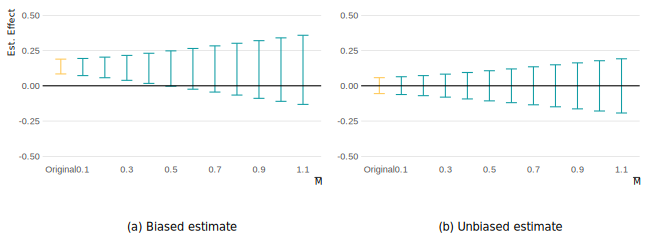
]

---
# How do we match?

- Match on covariates or outcomes? Levels or trends?

- Propensity score matching? Optimal matching? etc.

--

This paper:

- **.darkorange[Match on time-invariant covariates]** that could make groups behave differently.
  
  - Use distribution of  covariates to match on a template.

- Use of **.darkorange[Mixed-Integer Programming (MIP) Matching]** .small[(Zubizarreta, 2015; Bennett, Zubizarreta, & Vielma, 2020)]:

  - Balance covariates directly
  
  - Yield largest matched sample under balancing constraints (cardinality matching)
  
  - Works fast with large samples


---
# Data Generating Processes

.center[

]

---
# SEP adoption over time

.center[

]
