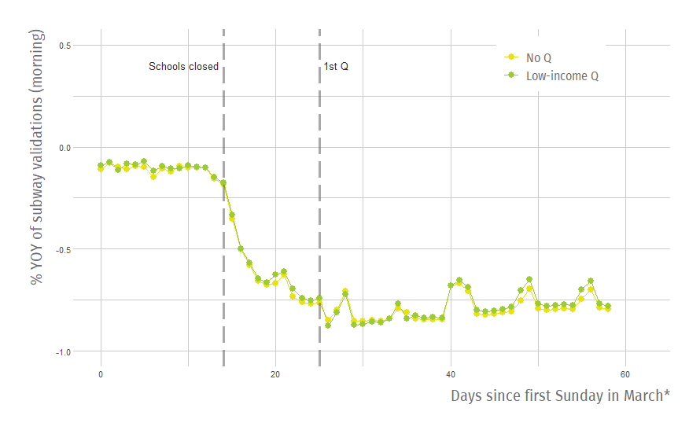
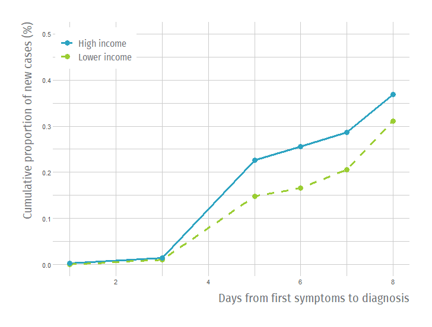

```{r setup, include=FALSE}
options(htmltools.dir.version = FALSE)
knitr::opts_chunk$set(fig.showtext = TRUE)
```

```{r xaringan-themer, include=FALSE, warning=FALSE}
library(xaringanthemer)

theme_xaringan(
  text_color = "#333f48",
  background_color = "#FFFFFF",
  accent_color = "#900DA4",
  text_font = "Fira Mono",
  text_font_use_google = TRUE,
  title_font = "Fira Sans Condensed",
  title_font_use_google = TRUE
)

style_mono_accent(
  #base_color = "#bf5700",
  extra_fonts = list(google_font("Fira Sans","200","300","400","500","600"),
                     google_font("Fira Sans Condensed")),
  base_color = "#333f48",
  header_font_google = google_font("Yanone Kaffeesatz","200","300","400","500","600","700"),
  text_font_google   = google_font("Roboto", "300", "300i","400","500"),
  code_font_google   = google_font("Fira Mono"),
  text_bold_color = "#333f48",
  text_font_size = "110%",
  colors = c(
    red = "#f34213",
    purple = "#900DA4",
    orange = "#ff8811",
    green = "#136f63",
    white = "#FFFFFF"),
  extra_css = list(
    ".remark-slide table" = list("display" = "table",
                   "width" = "80%",
                   "text-align" = "left"),
    ".remark-slide-number" = list("display" = "none"),
    ".strong" = list("font-weight" = "400"),
    ".big" = list("font-size" = "350%",
                     "font-family" = "Yanone Kaffeesatz",
                     "font-weight"="400"),
    ".small" = list("font-size" = "80%"),
    ".source" = list("color" = "#8c8c8c",
                     "font-size" = "80%"),
    ".remark-slide table td#highlight" = list("background-color" = "#eee1f0",
                                  "color" = "#900DA4",
                                  "font-weight" = "500"),
   # ".remark-slide table thead th" = list(),
    ".title-slide h1" = list("font-weight" = "500"),
    ".title-slide h2" = list("font-weight" = "400",
                             "font-size" =  "170%"),
    ".title-slide h3" = list("font-family" = "Roboto",
                             "font-size" = "100%",
                             "font-weight" = "200"),
    ".center2" = list("margin" = "0",
                      "position" = "absolute",
                      "top" = "50%",
                      "left" = "50%",
                      "-ms-transform" = "translate(-50%, -50%)",
                      "transform" = "translate(-50%, -50%)"),
    ".section-title h1" = list("color" = "#FFFFFF",
                               "font-size" = "2.3em",
                               "line-height" = "1.3"),
    ".medium" = list("font-size" = "1.4em"),
    ".sp-after-half" = list("margin-bottom" = "0.7em !important"),
    ".box-1,.box-1a,.box-1b,.section-title-1" = list("background-color" = "#0D0887"),
    ".box-2,.box-2a,.box-2b,.section-title-2" = list("background-color" = "#5601A4"),
    ".box-3,.box-3a,.box-3b,.section-title-3" = list("background-color" = "#900DA4"),
    ".box-4,.box-4a,.box-4b,.section-title-4" = list("background-color" = "#BF3984"),
    ".box-5,.box-5a,.box-5b,.section-title-5" = list("background-color" = "#E16462"),
    ".box-6,.box-6a,.box-6b,.section-title-6" = list("background-color" = "#F89441"),
    ".box-7,.box-7a,.box-7b,.section-title-7" = list("background-color" = "#FCCE25"),
    ".box-7, .box-6, .box-5, .box-4, .box-3, .box-2, .box-1" = list("color" = "#FFFFFF",
                                                                    "margin" = "0em auto",
                                                                    "overflow" = "hidden",
                                                                    "padding" = "0.4em 0.4em",
                                                                    "font-weight" = "600",
                                                                    "font-size" = "31px",
                                                                    "display" = "table",
                                                                    "text-align" = "center",
                                                                    "font-family" = "Fira Sans"),
    ".box-7a, .box-6a, .box-5a, .box-4a, .box-3a, .box-2a, .box-1a" = list("color" = "#FFFFFF",
                                                                          "left" = "0px",
                                                                          "overflow" = "hidden",
                                                                      "padding" = "0.4em 0.4em",
                                                                      "font-weight" = "600",
                                                                      "font-size" = "25px",
                                                                      "display" = "table",
                                                                      "text-align" = "center",
                                                                      "font-family" = "Fira Sans"),
       ".box-7b, .box-6b, .box-5b, .box-4b, .box-3b, .box-2b, .box-1b" = list("color" = "#FFFFFF",
                                                                          "left" = "0px",
                                                                          "overflow" = "hidden",
                                                                      "padding" = "0.4em 0.4em",
                                                                      "font-weight" = "600",
                                                                      "font-size" = "25px",
                                                                      "display" = "table",
                                                                      "text-align" = "left",
                                                                      "font-family" = "Fira Sans")
  )
)

#,"li" = list("font-size" = "150%")
#    "li" = list("font-size" = "110%"),
#    "ul" = list("font-size" = "110%"),
#color palette
#5601A4
#900DA4
#F89441
#FCCE25
```

## Motivation

.pull-left[
Many studies about **effect of quarantines** on COVID-19 spread:
- Some (+), some (0).

Differences in **populations**?

How appropriate is the **counterfactual**?

How about **heterogeneity**?
]
.pull-right[

]
---
## This paper{

- **Objective**: What was the effect of lockdowns on new COVID-19 cases by income level in Santiago?

- **Contributions**:
  - Use of small-area lockdowns.
  - Heterogeneity in effect by groups of interest.
  - Mediation analysis for potential mechanisms,
  
  
- **Quick preview of results**: 
  - Positive effectiveness of lockdowns on high-income areas; null effect for lower-income municipalities.
  - Effect partially mediated by mobility and testing differences.
  
---

background-position: 50% 50%
class: left, bottom, inverse
.big[
Context of Lockdowns<br>in the Metropolitan Region
]

---
## "Dynamic" Lockdowns in the Metropolitan Region{d

.pull-left[

]
.pull-rigth[
Early lockdowns in East side (*high-income*) + Santiago and Independencia (*lower-income*): **Heterogeneity** in types of municipalities.

Later lockdowns in other lower-income areas.

Quarantines were **not fully determined** by COVID spread.

]

---

background-position: 50% 50%
class: left, bottom, inverse
.big[
Augmented Synthetic Control Method
]

---
  
## An (Augmented) Synthetic Control Method Approach

- Let $Y_{it}(z)$ be the potential outcome under treatment $z$ for unit $i$ in period $t$:
   - E.g. $W_i$ is a treatment indicator, where unit $i$ is treated for all periods $T_0<T$.
   
- Under traditional **Synthetic Control Method** (SCM) (Abadie \& Gardeazabal, 2003), the counterfactual for $Y_{1T}$ is:
$$\hat{Y}_{1T}(0) = \sum_{W_i=0}\gamma_iY_{iT}$$

  
## An (Augmented) Synthetic Control Method Approach{data-background=#FFFFFF;}

- Under **Augmented Synthetic Control Method** (ASCM) (Ben-Michael et al., 2020) there is a correction for poor fit:
$$\hat{Y}^{aug}_{1T}(0) = \sum_{W_i=0}\gamma_iY_{iT}+\color{#2ca3c1}{(\hat{m}_{iT}(\mathbf{X_i})-\sum_{W_i=0}\gamma_i\hat{m}_{iT}(\mathbf{X_i}))}$$
  - $m_{iT}$: Estimator for $Y_{iT}(0)$
  - Extrapolation for ``bias correction''.
  - If ridge regression is used $\rightarrow$ penalization for extrapolation
  
  
## Identification Strategy{data-background=#FFFFFF;}

- For estimating a **causal effect**:
  1) Assignment of treatment is **random** conditional on donor pool, obs. covariates, and pre-treatment trends.

## Identification Strategy{data-background=#FFFFFF;}

- For estimating a **causal effect**:
  1) Assignment of treatment is **random** conditional on donor pool, obs. covariates, and pre-treatment trends.
  <p style="color: #2ca3c1;">$\rightarrow$ Pre-intervention trend did **not fully determine** quarantine assignment.</p>

## Identification Strategy{data-background=#FFFFFF;}

- For estimating a **causal effect**:
  1) Assignment of treatment is **random** conditional on donor pool, obs. covariates, and pre-treatment trends.
  <p style="color: #2ca3c1;">$\rightarrow$ Pre-intervention trend did **not fully determine** quarantine assignment.</p>
  2) **SUTVA** (e.g. no spillovers)

## Identification Strategy{data-background=#FFFFFF;}

- For estimating a **causal effect**:
  1) Assignment of treatment is **random** conditional on donor pool, obs. covariates, and pre-treatment trends.
  <p style="color: #2ca3c1;">$\rightarrow$ Pre-intervention trend did **not fully determine** quarantine assignment.</p>
  2) **SUTVA** (e.g. no spillovers)
  <p style="color: #2ca3c1;">$\rightarrow$ Take out **buffer municipalities** from donor pool.</p>

## Identification Strategy{data-background=#FFFFFF;}

- For estimating a **causal effect**:
  1) Assignment of treatment is **random** conditional on donor pool, obs. covariates, and pre-treatment trends.
  <p style="color: #2ca3c1;">$\rightarrow$ Pre-intervention trend did **not fully determine** quarantine assignment.</p>
  2) **SUTVA** (e.g. no spillovers)
  <p style="color: #2ca3c1;">$\rightarrow$ Take out **buffer municipalities** from donor pool.</p>
  3) Intervention had **no effect** prior to $t=0$

## Identification Strategy{data-background=#FFFFFF;}

- For estimating a **causal effect**:
  1) Assignment of treatment is **random** conditional on donor pool, obs. covariates, and pre-treatment trends.
  <p style="color: #2ca3c1;">$\rightarrow$ Pre-intervention trend did **not fully determine** quarantine assignment.</p>
  2) **SUTVA** (e.g. no spillovers)
  <p style="color: #2ca3c1;">$\rightarrow$ Take out **buffer municipalities** from donor pool.</p>
  3) Intervention had **no effect** prior to $t=0$
  <p style="color: #2ca3c1;">$\rightarrow$ Use **date of announcement** as $t=0$.</p>

# Results on Spread of COVID-19

## Some Parameters{data-background=#FFFFFF;}

- **Time period:** March 15th to May 4th.
- **Donor pool:** municipalities > 70.000 hab.
- **Obs. covariates:** Population density, income per capita, poverty rate, total cases.
- **Types of municipalities:**
  - High-income Q: Las Condes, Lo Barnechea, Nunoa, Providencia, Vitacura.
  - Low-income Q: (1) Santiago, Independencia, (2) Puente Alto, El Bosque, San Bernardo, Quinta Normal, PAC.
  - Donor Pool: All other municipalities $\not\in$ Q

## Effect on New Cases: Average Treatment Effect of the Treated{data-background=#FFFFFF;}

<div class="grid-container">
<div class="col-6 grid-item">

</div>
  <div class="col-6 grid-item">
  <br>
  <ul>
<li>**Decreasing trend** in number of new cases over time.</li>
</ul>
  </div>
</div>

## Effect on New Cases: High-Income{data-background=#FFFFFF;}

<div class="grid-container">
<div class="col-6 grid-item">

</div>
  <div class="col-6 grid-item">
  <br>
  <ul>
<li>**Negative effect** on new cases $t\geq 12$</li>
</ul>
  </div>
</div>

## Effect on New Cases: Low-Income (All){data-background=#FFFFFF;}

<div class="grid-container">
<div class="col-6 grid-item">

</div>
  <div class="col-6 grid-item">
  <br>
  <ul>
<li>**Null effect**, but shorter post-treatment period</li>
</ul>
  </div>
</div>


## Effect on New Cases: Low-Income (1st Wave){data-background=#FFFFFF;}

<div class="grid-container">
<div class="col-6 grid-item">

</div>
  <div class="col-6 grid-item">
  <br>
  <ul>
<li>**Null effect** for same period as high-income.</li>
</ul>
  </div>
</div>

# Potential Mechanisms

## Why differential effects?{data-background=#FFFFFF;}

- **Differential costs** of staying at home $\rightarrow$ <span style="color: #2ca3c1;">**Mobility**</span>:
  - Savings constraints
  - Inability to work from home
  
- **Information asymmetry** by income level $\rightarrow$ <span style="color: #2ca3c1;">**Testing**</span>:
  - Delay in testing results $\rightarrow$ difficulty in tracing


## Differences in mobility: Subway validations{data-background=#FFFFFF;}


## Low income Q similar to No Q{data-background=#FFFFFF;}



## High income Q larger drop in mobility{data-background=#FFFFFF;}


## High income Q larger drop in mobility{data-background=#FFFFFF;}


## Differences in mobility: ASCM using Mobility Index{data-background=#FFFFFF;}


## Differences in testing: Private sector more lax about testing{data-background=#FFFFFF;}


## Differences in testing: Time to diagnosis{data-background=#FFFFFF;}



# Conclusions

## Conclusions{data-background=#FFFFFF;}

<div class="grid-container2">
<div class="col-6 grid-item">

</div>
  <div class="col-6 grid-item">
  <br>
  <ul>
<li>Policies have **heterogeneous** effects</li>
<li>**Analyze mechanisms** and identify bottlenecks.</li>
<li>**Bundles** of policies can help reduce differences.</li>
<li>Importance of **timely data**.</li>
</ul>
  </div>
</div>

# Heterogeneity in Policy Effectiveness against<br>COVID-19 Spread in Chile
