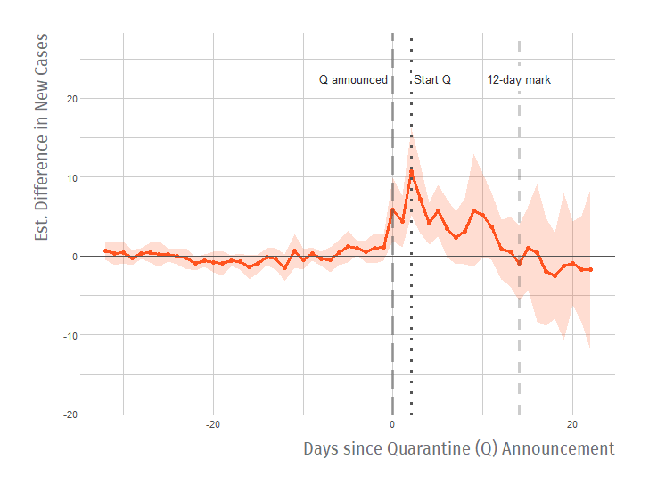
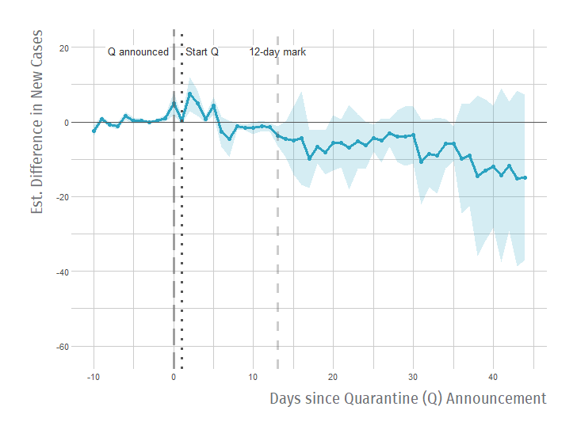
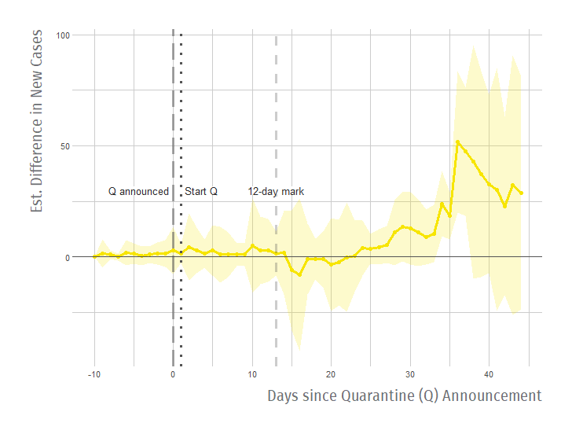
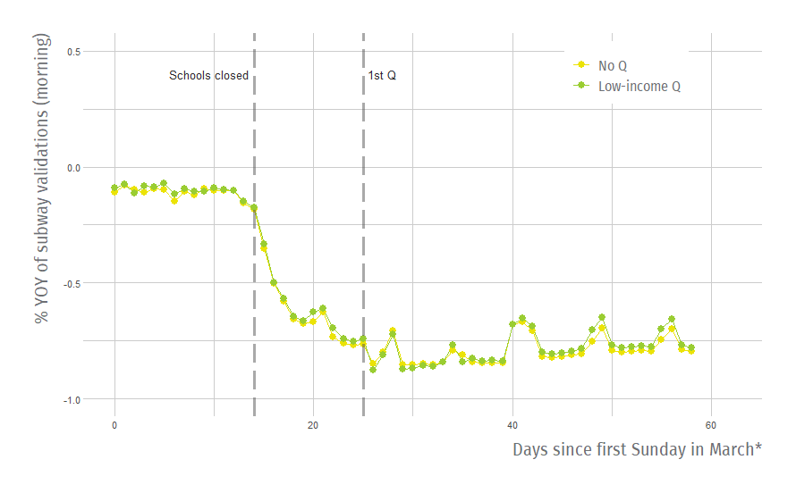
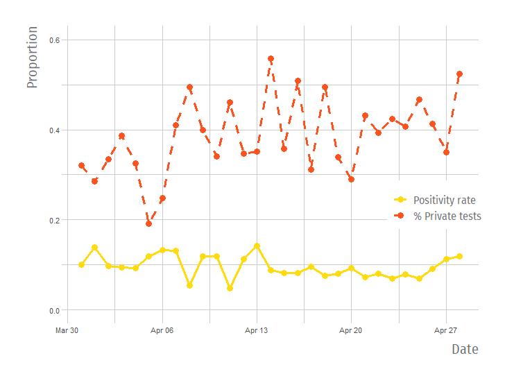
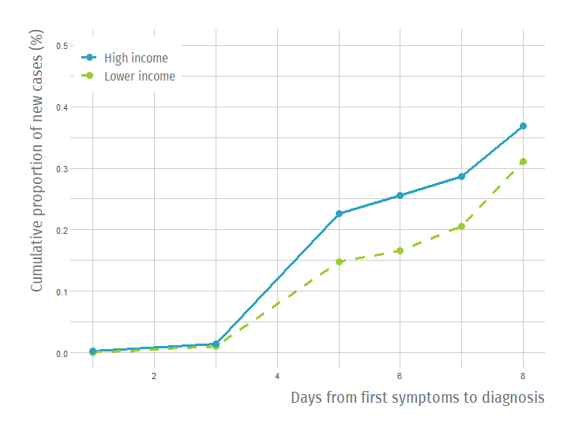

```{r setup, include=FALSE,message=FALSE,warning=FALSE}
#smaller: true

#knitr::opts_chunk$set(
#	echo = TRUE,
#	message = FALSE,
#	warning = FALSE,
#	cache = TRUE,
#	tidy = TRUE,
#	tidy.opts = list(width.cutoff = 60)
#)

#{data-background=#FFFFFF;}
```


## Motivation{data-background=#FFFFFF;}

<div class="grid-container2">
<div class="col-6 grid-item">

</div>
  <div class="col-6 grid-item">
  <br>
  <ul>
<li>Many studies about **effect of quarantines** on COVID-19 spread: <br>Some (+), some (0).</li>
<li>Differences in **populations**?</li>
<li>How appropriate is the **counterfactual**?</li>
<li>How about **heterogeneity**?</li>
</ul>
  </div>
</div>

## This paper{data-background=#FFFFFF;}

- **Objective**: What was the effect of lockdowns on new COVID-19 cases by income level in Santiago?

- **Contributions**:
  - Use of small-area lockdowns.
  - Heterogeneity in effect by groups of interest.
  - Mediation analysis for potential mechanisms,
  
  
- **Quick preview of results**: 
  - Positive effectiveness of lockdowns on high-income areas; null effect for lower-income municipalities.
  - Effect partially mediated by mobility and testing differences.
  
# Context of Lockdowns<br>in the Metropolitan Region

<!-- ## COVID-19 in Santiago{data-background=#FFFFFF;} -->

<!-- <div class="grid-container2"> -->
<!-- <div class="col-6 grid-item"> -->
<!-- <br> -->
<!--  -->
<!-- </div> -->
<!--   <div class="col-6 grid-item"> -->
<!--   <br> -->
<!--   <ul> -->
<!-- <li>**Week 03/01 to 03/07:** Few cases starting in the East side.</li> -->
<!-- </ul> -->
<!--   </div> -->
<!-- </div> -->

<!-- ## COVID-19 in Santiago{data-background=#FFFFFF;} -->

<!-- <div class="grid-container2"> -->
<!-- <div class="col-6 grid-item"> -->
<!-- <br> -->
<!--  -->
<!-- </div> -->
<!--   <div class="col-6 grid-item"> -->
<!--   <br> -->
<!--   <ul> -->
<!-- <li>Week 03/01 to 03/07: Few cases starting in the East side.</li> -->
<!-- <li>**Week 03/15 to 03/21:** Most cases concentrated on the East side.</li> -->
<!-- </ul> -->
<!--   </div> -->
<!-- </div> -->

<!-- ## COVID-19 in Santiago{data-background=#FFFFFF;} -->

<!-- <div class="grid-container2"> -->
<!-- <div class="col-6 grid-item"> -->
<!-- <br> -->
<!--  -->
<!-- </div> -->
<!--   <div class="col-6 grid-item"> -->
<!--   <br> -->
<!--   <ul> -->
<!-- <li>Week 03/01 to 03/07: Few cases starting in the East side.</li> -->
<!-- <li>Week 03/15 to 03/21: Most cases concentrated on the East side.</li> -->
<!-- <li>**Week 04/12 to 04/18:** Cases spread throughout Santiago.</li> -->
<!-- </ul> -->
<!--   </div> -->
<!-- </div> -->


## "Dynamic" Lockdowns in the Metropolitan Region{data-background=#FFFFFF;}

<div class="grid-container2">
<div class="col-6 grid-item">
<br>

</div>
  <div class="col-6 grid-item">
  <br>
  <ul>
<li>Early lockdowns in East side (*high-income*) + Santiago and Independencia (*lower-income*): **Heterogeneity** in types of municipalities.</li>
<li>Later lockdowns in other lower-income areas.</li>
<li>Quarantines were **not fully determined** by COVID spread.</li>
</ul>
  </div>
</div>

# Augmented Synthetic Control Method
  
## An (Augmented) Synthetic Control Method Approach{data-background=#FFFFFF;}

- Let $Y_{it}(z)$ be the potential outcome under treatment $z$ for unit $i$ in period $t$:
   - E.g. $W_i$ is a treatment indicator, where unit $i$ is treated for all periods $T_0<T$.
- Under traditional **Synthetic Control Method** (SCM) (Abadie \& Gardeazabal, 2003), the counterfactual for $Y_{1T}$ is:
$$\hat{Y}_{1T}(0) = \sum_{W_i=0}\gamma_iY_{iT}$$

  
## An (Augmented) Synthetic Control Method Approach{data-background=#FFFFFF;}

- Under **Augmented Synthetic Control Method** (ASCM) (Ben-Michael et al., 2020) there is a correction for poor fit:
$$\hat{Y}^{aug}_{1T}(0) = \sum_{W_i=0}\gamma_iY_{iT}+\color{#2ca3c1}{(\hat{m}_{iT}(\mathbf{X_i})-\sum_{W_i=0}\gamma_i\hat{m}_{iT}(\mathbf{X_i}))}$$
  - $m_{iT}$: Estimator for $Y_{iT}(0)$
  - Extrapolation for ``bias correction''.
  - If ridge regression is used $\rightarrow$ penalization for extrapolation
  
  
## Identification Strategy{data-background=#FFFFFF;}

- For estimating a **causal effect**:
  1) Assignment of treatment is **random** conditional on donor pool, obs. covariates, and pre-treatment trends.

## Identification Strategy{data-background=#FFFFFF;}

- For estimating a **causal effect**:
  1) Assignment of treatment is **random** conditional on donor pool, obs. covariates, and pre-treatment trends.
  <p style="color: #2ca3c1;">$\rightarrow$ Pre-intervention trend did **not fully determine** quarantine assignment.</p>

## Identification Strategy{data-background=#FFFFFF;}

- For estimating a **causal effect**:
  1) Assignment of treatment is **random** conditional on donor pool, obs. covariates, and pre-treatment trends.
  <p style="color: #2ca3c1;">$\rightarrow$ Pre-intervention trend did **not fully determine** quarantine assignment.</p>
  2) **SUTVA** (e.g. no spillovers)

## Identification Strategy{data-background=#FFFFFF;}

- For estimating a **causal effect**:
  1) Assignment of treatment is **random** conditional on donor pool, obs. covariates, and pre-treatment trends.
  <p style="color: #2ca3c1;">$\rightarrow$ Pre-intervention trend did **not fully determine** quarantine assignment.</p>
  2) **SUTVA** (e.g. no spillovers)
  <p style="color: #2ca3c1;">$\rightarrow$ Take out **buffer municipalities** from donor pool.</p>

## Identification Strategy{data-background=#FFFFFF;}

- For estimating a **causal effect**:
  1) Assignment of treatment is **random** conditional on donor pool, obs. covariates, and pre-treatment trends.
  <p style="color: #2ca3c1;">$\rightarrow$ Pre-intervention trend did **not fully determine** quarantine assignment.</p>
  2) **SUTVA** (e.g. no spillovers)
  <p style="color: #2ca3c1;">$\rightarrow$ Take out **buffer municipalities** from donor pool.</p>
  3) Intervention had **no effect** prior to $t=0$

## Identification Strategy{data-background=#FFFFFF;}

- For estimating a **causal effect**:
  1) Assignment of treatment is **random** conditional on donor pool, obs. covariates, and pre-treatment trends.
  <p style="color: #2ca3c1;">$\rightarrow$ Pre-intervention trend did **not fully determine** quarantine assignment.</p>
  2) **SUTVA** (e.g. no spillovers)
  <p style="color: #2ca3c1;">$\rightarrow$ Take out **buffer municipalities** from donor pool.</p>
  3) Intervention had **no effect** prior to $t=0$
  <p style="color: #2ca3c1;">$\rightarrow$ Use **date of announcement** as $t=0$.</p>

# Results on Spread of COVID-19

## Some Parameters{data-background=#FFFFFF;}

- **Time period:** March 15th to May 4th.
- **Donor pool:** municipalities > 70.000 hab.
- **Obs. covariates:** Population density, income per capita, poverty rate, total cases.
- **Types of municipalities:**
  - High-income Q: Las Condes, Lo Barnechea, Nunoa, Providencia, Vitacura.
  - Low-income Q: (1) Santiago, Independencia, (2) Puente Alto, El Bosque, San Bernardo, Quinta Normal, PAC.
  - Donor Pool: All other municipalities $\not\in$ Q

## Effect on New Cases: Average Treatment Effect of the Treated{data-background=#FFFFFF;}

<div class="grid-container">
<div class="col-6 grid-item">

</div>
  <div class="col-6 grid-item">
  <br>
  <ul>
<li>**Decreasing trend** in number of new cases over time.</li>
</ul>
  </div>
</div>

## Effect on New Cases: High-Income{data-background=#FFFFFF;}

<div class="grid-container">
<div class="col-6 grid-item">

</div>
  <div class="col-6 grid-item">
  <br>
  <ul>
<li>**Negative effect** on new cases $t\geq 12$</li>
</ul>
  </div>
</div>

## Effect on New Cases: Low-Income (All){data-background=#FFFFFF;}

<div class="grid-container">
<div class="col-6 grid-item">

</div>
  <div class="col-6 grid-item">
  <br>
  <ul>
<li>**Null effect**, but shorter post-treatment period</li>
</ul>
  </div>
</div>


## Effect on New Cases: Low-Income (1st Wave){data-background=#FFFFFF;}

<div class="grid-container">
<div class="col-6 grid-item">

</div>
  <div class="col-6 grid-item">
  <br>
  <ul>
<li>**Null effect** for same period as high-income.</li>
</ul>
  </div>
</div>

# Potential Mechanisms

## Why differential effects?{data-background=#FFFFFF;}

- **Differential costs** of staying at home $\rightarrow$ <span style="color: #2ca3c1;">**Mobility**</span>:
  - Savings constraints
  - Inability to work from home
  
- **Information asymmetry** by income level $\rightarrow$ <span style="color: #2ca3c1;">**Testing**</span>:
  - Delay in testing results $\rightarrow$ difficulty in tracing


## Differences in mobility: Subway validations{data-background=#FFFFFF;}


## Low income Q similar to No Q{data-background=#FFFFFF;}



## High income Q larger drop in mobility{data-background=#FFFFFF;}


## High income Q larger drop in mobility{data-background=#FFFFFF;}


## Differences in mobility: ASCM using Mobility Index{data-background=#FFFFFF;}


## Differences in testing: Private sector more lax about testing{data-background=#FFFFFF;}



## Differences in testing: Time to diagnosis{data-background=#FFFFFF;}



# Conclusions

## Conclusions{data-background=#FFFFFF;}

<div class="grid-container2">
<div class="col-6 grid-item">

</div>
  <div class="col-6 grid-item">
  <br>
  <ul>
<li>Policies have **heterogeneous** effects</li>
<li>**Analyze mechanisms** and identify bottlenecks.</li>
<li>**Bundles** of policies can help reduce differences.</li>
<li>Importance of **timely data**.</li>
</ul>
  </div>
</div>

# Heterogeneity in Policy Effectiveness against<br>COVID-19 Spread in Chile
